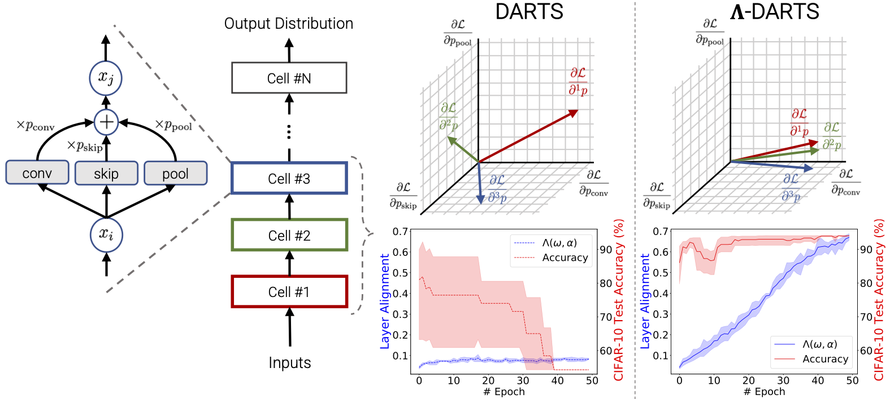

# &Lambda;-DARTS
This code accompanies the paper:\
\[[ICLR'2023](https://iclr.cc/)\] \[[&Lambda;-Darts: Mitigating Performance Collapse by Harmonizing Operation Selection among Cells](https://arxiv.org/abs/2210.07998)\]\
Sajad Movahedi, Melika Adabinejad, Ayyoob Imani, Arezou Keshavarz, Mostafa Dehghani, Azadeh Shakery, Babak N Araabi 

The code is based on the implementation of [DARTS](https://github.com/quark0/darts), [iDARTS](https://github.com/MiaoZhang0525/iDARTS) and [DARTS-PT](https://github.com/ruocwang/darts-pt).

Differentiable neural architecture search (DARTS) is a popular method for neural architecture search (NAS), which performs cell-search and utilizes continuous relaxation to improve the search efficiency via gradient-based optimization. The main shortcoming of DARTS is performance collapse, where the discovered architecture suffers from a pattern of declining quality during search. Performance collapse has become an important topic of research, with many methods trying to solve the issue through either regularization or fundamental changes to DARTS.
However, the weight-sharing framework used for cell-search in DARTS and the convergence of architecture parameters has not been analyzed yet. In this paper, we provide a thorough and novel theoretical and empirical analysis on DARTS and its point of convergence.
We show that DARTS suffers from a specific structural flaw due to its weight-sharing framework that limits the convergence of DARTS to saturation points of the softmax function. This point of convergence gives an unfair advantage to layers closer to the output in choosing the optimal architecture, causing performance collapse. We then propose two new regularization terms that aim to prevent performance collapse by harmonizing operation selection via aligning gradients of layers. 
Experimental results on six different search spaces and three different datasets show that our method (Λ-DARTS) does indeed prevent performance collapse, providing justification for our theoretical analysis and the proposed remedy.



## Requirements
```
Python >= 3.7
PyTorch >= 1.1.0
torchvision == 0.3.0
cuda version 10
```
For training with ImageNet:
```
pytorch_lightning == 1.5.8
torchvision == 0.13.0
```

## Datasets
* **CIFAR-10, CIFAR-100, SVHN:** 
Can be automatically downloaded by torchvision.
* **ImageNet:** 
Download from here -> (https://www.kaggle.com/competitions/imagenet-object-localization-challenge/data)
Run ```build_validation_tree.sh``` in this location:
    ‍‍‍```[where ever you have put imagenet]/ILSVRC/Data/CLS-LOC/val```
* **NasBench201:** Download the benchmark file from this repository -> (https://github.com/D-X-Y/AutoDL-Projects)


## Citation
If you find any part of this code useful in your research, please cite our paper:
```

@misc{movahedi2022lambdadarts,
    title={{\(\Lambda\)}-DARTS: Mitigating Performance Collapse by Harmonizing Operation Selection among Cells}, 
    author={Sajad Movahedi and Melika Adabinejad and Ayyoob Imani and Arezou Keshavarz and Mostafa Dehghani and Azadeh Shakery and Babak N. Araabi},
    year={2022},
    eprint={2210.07998},
    archivePrefix={arXiv},
    primaryClass={cs.LG}
}

```

